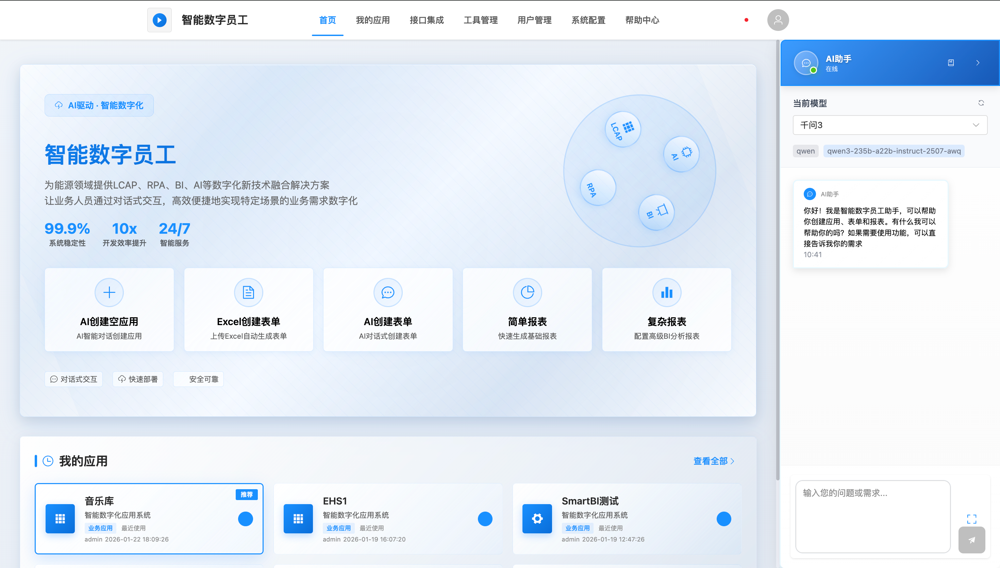
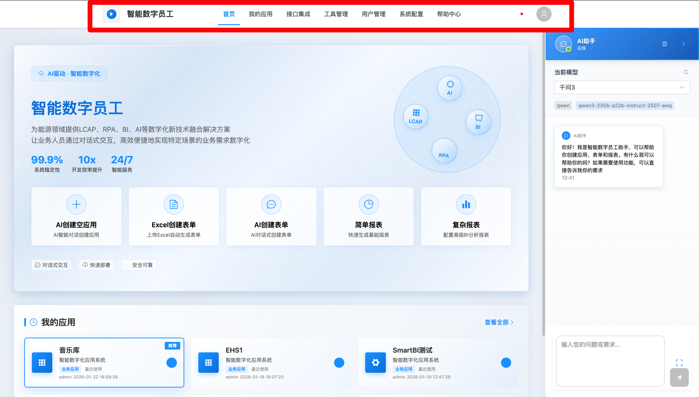
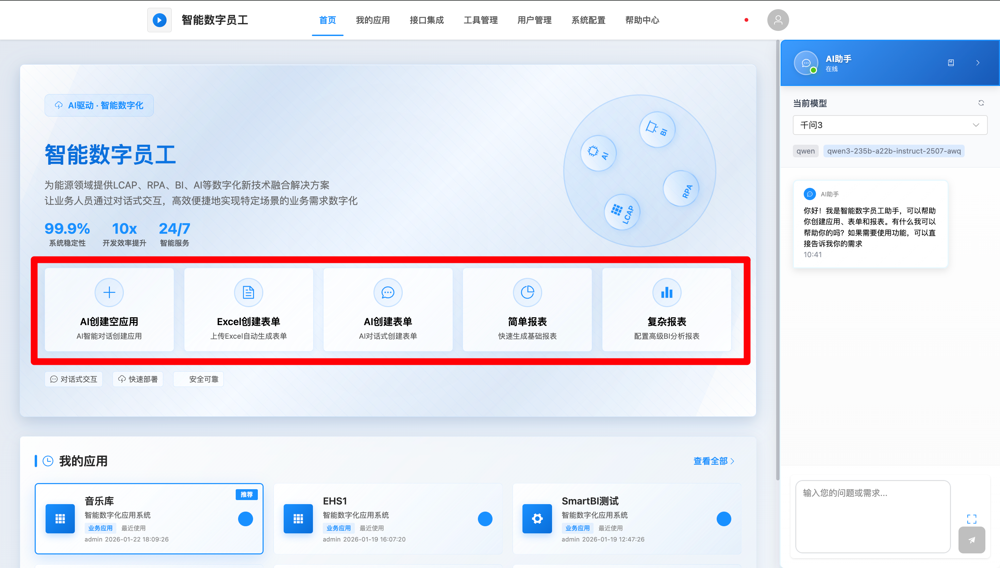
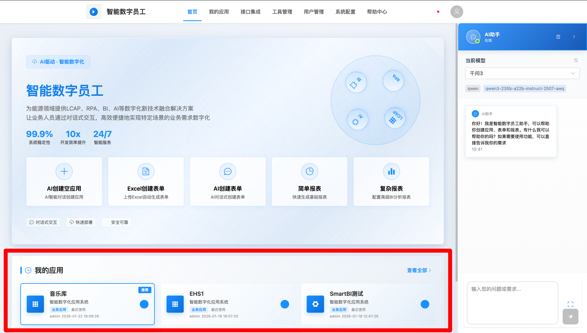

# ⾸⻚功能

## 功能概述

⾸⻚是智能数字员⼯系统的总⼊⼝⻚⾯， ⾯向所有平台⽤⼾， 提供导航栏、 ⾼频功能快捷⼊⼝、 最近访问应⽤展⽰、 AI智能对话等核⼼能⼒。 作为⽤⼾进⼊系统的第⼀站， ⾸⻚集成了最常⽤的功能⼊⼝， 帮助⽤⼾快速开始⼯作。

## 平台导航栏

导航栏位于⻚⾯顶部， 提供系统各核⼼模块的访问⼊⼝及⽤⼾基础操作功能。

主要功能区：

 模块导航： 左侧展⽰系统Logo， 中间区域包含核⼼模块⼊⼝（如"⾸⻚"、 "我的应

⽤"、 "接⼝集成"等） 。 当前所在模块会⾼亮显⽰。导航栏⼊⼝根据⽤⼾⻆⾊动态显⽰。 管理员可查看全部功能模块， 普通⽤⼾仅可⻅"⾸⻚"、 "我的应⽤"、 "帮助中⼼"等基础模块。

 ⽤⼾操作： 右侧提供⽤⼾头像和⽤⼾名下拉菜单， 包含"个⼈信息"、 "系统设置"、 "帮助中⼼"、 "主体切换"、 "退出登录"等选项。

## **AI**智能对话助⼿

AI智能对话模块位于⻚⾯右侧， 作为⾸⻚的智能辅助⼯具， 为⽤⼾提供系统操作指引、 功能咨询、 问题解答等服务。

核⼼能⼒：

对话交互： ⽀持⾃然语⾔输⼊， AI⾃动识别并解答。

 操作指引： 可指导⽤⼾创建应⽤， 解答操作流程。

 常⻅问题： 内置知识库， 快速解答功能介绍、 故障排查等问题。

 窗⼝控制： ⽀持最⼩化悬浮、 最⼤化展开。

 历史记录： 手动保存⽤⼾对话历史， ⽅便回顾，由用户手动开展新论对话。

## 快速创建⼊⼝

在⾸⻚提供极简、 ⾼效的应⽤初始化快捷⼊⼝， ⽀持⽤⼾快速创建基础应⽤框架。

以下是各快捷⼊⼝的详细说明：

| 快捷入口           | 功能说明                                                     |
| :----------------- | :----------------------------------------------------------- |
| **AI创建空应⽤**   | 快速打开创建空应⽤⻚⾯， AI辅助⽣成应⽤名称和编码， 完成应⽤框架初始化。适⽤场景： 从零开始搭建新应⽤， 需要⾃定义应⽤结构和数据源配置。 |
| **AI创建表单**     | 通过⾃然语⾔描述需求，AI⾃动分析、 梳理字段、 ⽣成表单。适⽤场景： ⽆现成模板， 通过描述业务需求让AI智能⽣成表单。 |
| **Excel创建表单**  | 上传Excel⽂件快速⽣成表单， AI⾃动解析表头、 字段类型等信息。适⽤场景： 已有Excel模板或数据样例， 希望快速转换为在线表单系统。 |
| **简单报表**       | 基于业务对象或数据源创建简单可视化分析看板， ⾃动⽣成图表组件。适⽤场景： 需要对应⽤数据进⾏统计分析和可视化展⽰。 |
| **复杂报表**       | 功能说明： 集成SmartBI平台能⼒，⽀持即席查询、 交互式仪表盘、 透视分析等专业报表。适⽤场景： 多维度数据分析、 交叉查询、 专业报表制作。 |
| **AI引⽤其他⻚⾯** | 通过AI对话智能检索并挂载其他已授权应⽤下的现有表单， 实现跨应⽤复⽤。适⽤场景： 需要使⽤其他应⽤中已有的表单功能， 避免重复开发。 |

## 最近创建应⽤展⽰

⾸⻚中部区域展⽰⽤⼾近期操作过的应⽤列表， 提供快速访问通道。

 快速跳转： 点击应⽤名称， 直接进⼊该应⽤的开发详情⻚。

 实时更新： 列表根据⽤⼾的操作时间实时排序， 最新操作的应⽤排在最前。

 更多查看： 当近期应⽤超过8条时， 可点击右上⻆【查看全部】 跳转⾄完整应⽤列表。

 权限控制： 仅展⽰当前⽤⼾有权限访问的应⽤， 确保信息安全。

> 对于初次使⽤者， 建议优先尝试"AI创建表单"或"Excel创建表单"来快速熟悉平台能⼒。
>
> 如果需要制作跨应⽤的综合报表， 请使⽤"复杂报表"功能， 它能提供更强⼤的数据处理能⼒。
>
> 所有创建的⻚⾯和报表， 创建后都可以在"低代码设计器"中进⾏⼆次编辑和精细化调整。

 
<strong>📌 【操作建议】</strong>   
  对于初次使⽤者， 建议优先尝试"AI创建表单"或"Excel创建表单"来快速熟悉平台能⼒。   
  如果需要制作跨应⽤的综合报表， 请使⽤"复杂报表"功能， 它能提供更强⼤的数据处理能⼒。 
  所有创建的⻚⾯和报表， 创建后都可以在"低代码设计器"中进⾏⼆次编辑和精细化调整。 

