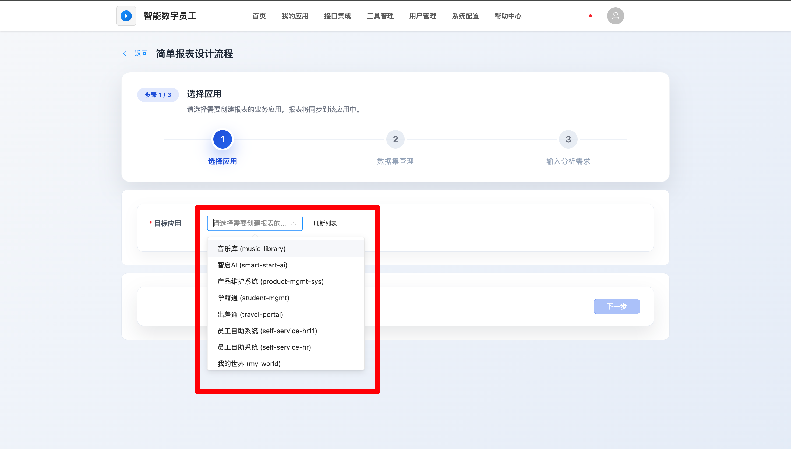
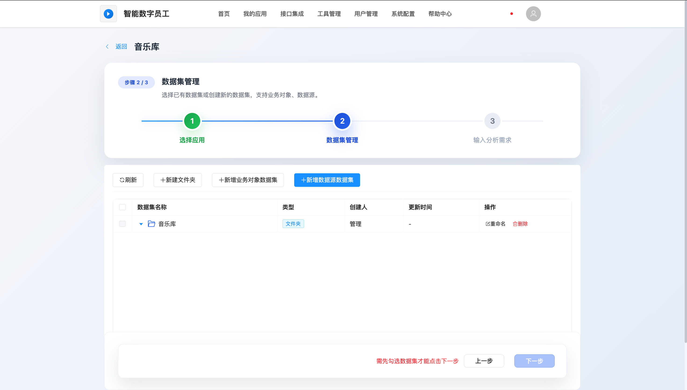
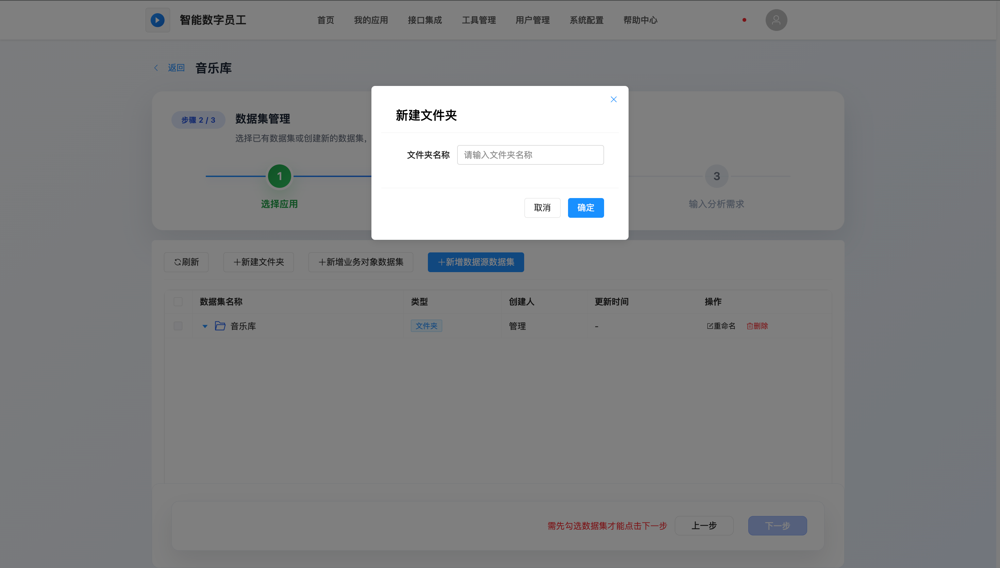
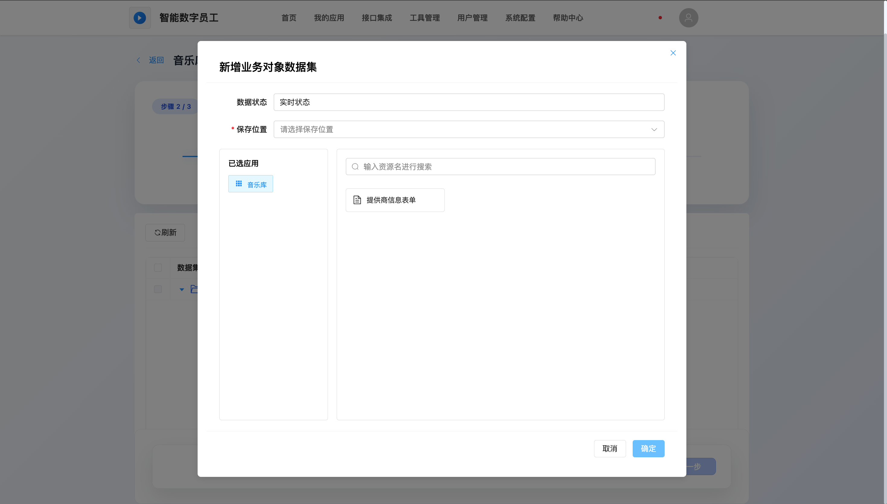
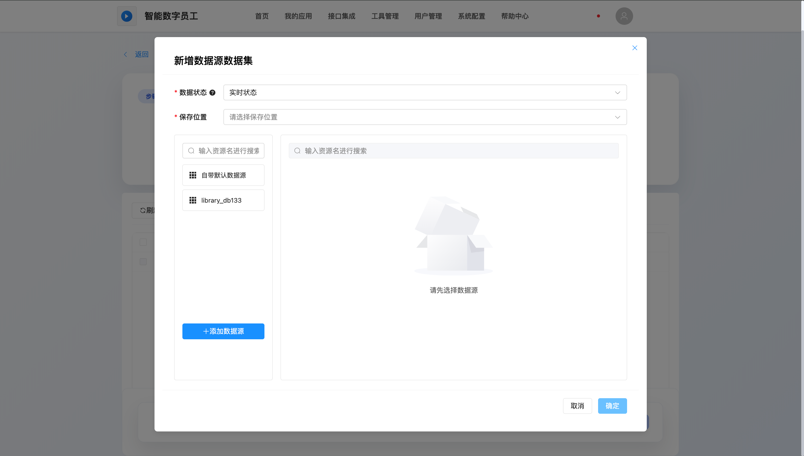
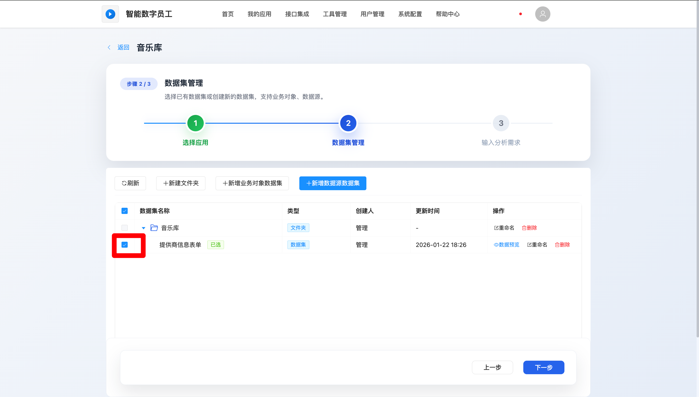
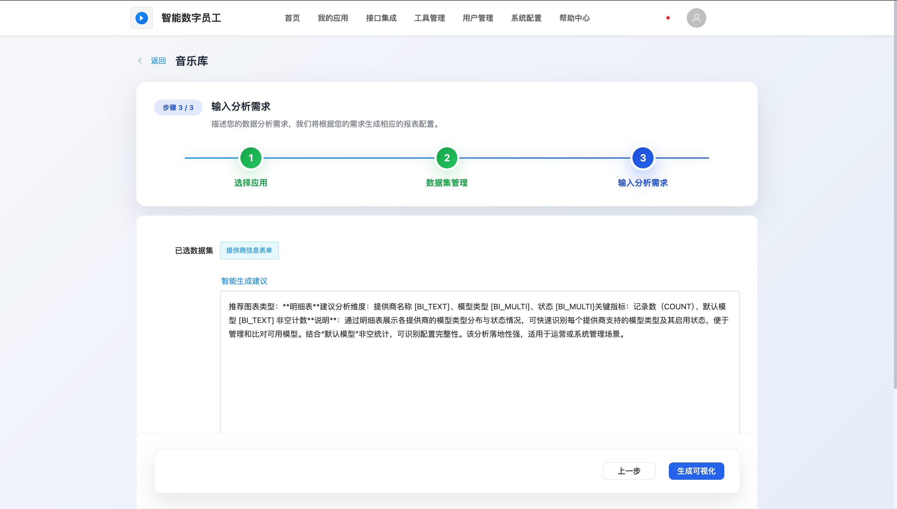
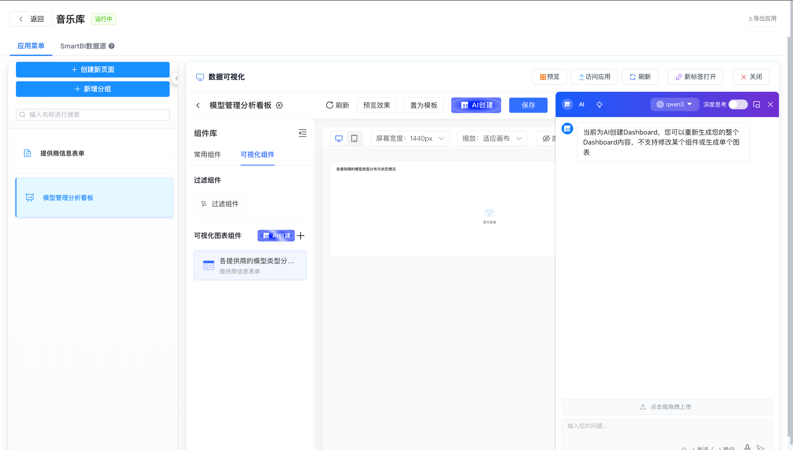

# 创建简单报表

## 创建简单报表⼊⼝

平台提供多种便捷⼊⼝快速进⼊简单报表创建流程，⽤⼾可根据当前所在位置和业务需求，选择最便捷的⽅式创建数据可视化分析看板。

**方式⼀： ⾸⻚快速创建⼊⼝**

1. 登录智能数字员⼯平台后，默认进⼊⾸⻚

2. 在⾸⻚中间区域找到"快速创建⼊⼝"模块

3. 点击【简单报表】快捷按钮
4. 系统弹出应⽤选择对话框，选择需要挂载报表的⽬标应⽤
5. 确认后跳转到简单报表创建⻚⾯，进⼊数据集管理步骤

**适⽤场景：**⽤⼾需要快速创建新的数据分析报表。

**方式二：应⽤⻚⾯创建**

1. 点击导航栏的【我的应⽤】进⼊应⽤管理⻚⾯

2. 选择需要添加报表的应⽤，点击应⽤名称进⼊应⽤开发⻚⾯

3. 在低代码设计器中点击【新建⻚⾯】按钮
4. 在创建⽅式选择菜单中， 选择【简单报表】
5. 直接进⼊数据集管理和报表设计流程

**适⽤场景：** 为现有应⽤添加数据分析功能

**方式三：通过AI智能助⼿创建**

1. 在平台任意⻚⾯，点击右下⻆的AI智能对话助⼿图标
2. 在对话框中描述报表需求，如"我想分析应⽤发布数据，按⽉统计发布数量"
3. AI助⼿理解需求后，会询问⽬标应⽤和数据来源

4. 确认信息后，AI助⼿会引导进⼊简单报表创建流程，并根据需求推荐分析维度

**适⽤场景：**⽤⼾需要AI协助确定分析思路和图表类型。

 <strong>💡操作提示：</strong>  数据准备：创建报表前建议先确认数据源和业务对象是否已配置 
AI辅助分析：系统会根据数据集⾃动推荐分析维度和图表类型 
快速迭代：⽀持保存草稿，可随时返回继续编辑 

 <strong>⚠️注意事项：</strong>  创建简单报表需要"应⽤管理员"或"平台管理员"⻆⾊权限 需要先创建或选择数据集才能进⾏后续分析 简单报表中的分析图形只可对单一数据表或者业务对象进行分析，不能跨表分析，需要跨表分析请选择复杂报表 

## 功能概述

**核⼼价值：**

 零⻔槛可视化：⽆需专业BI技能，通过AI驱动实现数据可视化

 快速⽣成：从数据集创建到看板⽣成，全流程AI⾃动化

 灵活编辑：⽀持⾃定义图表类型、主题样式和布局

 即时预览：⽀持实时预览使⽤端效果

**适⽤场景：**

 业务数据统计分析(如销售数据、⽤⼾增⻓、订单趋势等)

 管理驾驶舱搭建(如关键指标监控、部⻔绩效看板等)

 数据报告⾃动化(如⽇报、周报、⽉报等)技术特⾊

 ⽀持透视表、柱状图、折线图、饼图等多种图表类型

 提供浅⾊/深⾊两种标准主题，⽀持⾃定义配⾊

 集成低代码可视化设计器，拖拽式编辑体验

## 关联应⽤选择

从⾸⻚进⼊简单报表创建⻚⾯时， 需要先⼿动关联应⽤。 可选择到本⼈创建或本⼈所运维的所有应⽤。

## 数据集管理

⽀持对数据集⽂件夹及数据集进⾏新增、修改、删除操作。⽀持关联已有的业务应⽤或连接新的数据源创建数据集。

**步骤一：数据集文件夹管理**

在进入到数据源管理页面时平台会自动生成一个以应用名称为名字的数据集文件夹，用户可将数据集归集在此文件夹进行管理，用户也可根据意愿或者业务需求点击“新增文件夹”按钮进行添加文件夹，也支持对文件夹进行重命名、删除。

**步骤二：添加数据集**

 在报表创建向导的第一步，需配置分析所需的数据集。

- **新增业务对象数据集：** 点击“新增业务对象数据集”，可选择到应用下表单的业务对象（在构建业务系统的过程中，「基于实际业务」对应用进行「模型构造」被称之为业务建模，而模型的实体被称为「业务对象」）进行分析。数据状态实时同步。

- **新增数据数据集：** 点击“新增数据源数据集”，输入数据库连接信息（主机IP、端口、用户名/密码），测试连接成功且保存后选择目标数据表。

- **管理操作：** 支持对数据集进行重命名、预览及删除。

**步骤三：选择分析数据集**

在数据集列表中勾选需要进行分析的一个或多个数据集，点击“下一步”进入需求录入环节。

## 报表分析需求录⼊及分析

AI根据选择的数据集进⾏分析， 输出初版的分析需求推荐（如分析维度、关键指标）。⽤⼾可在AI输出的基础上进⾏修改，也可按照意愿或者业务需求填写需要分析的维度指标等信息。

## 数据可视化报表板⽣成及编辑

在低代码设计器中直接嵌⼊数据可视化分析⻚⾯。 左侧提供组件库，中间为画布区，右侧进⾏主题设置。 ⽀持拖拽组件、 调整布局和保存。

- **AI模块：**

**AI创建新的分析图形：**

1. 点击左侧的【AI创建】按钮。
2. 在对话框中输入指令，例如“帮我生成按部门统计的事故数量柱状图”。
3. 平台自动生成图表并放置左侧的可视化图表组件上，用户可手动拖拽到页面上并调整布局。

**AI调整页面上布局以及页面上已有的分析图形：**

1. 点击右上角的【AI创建】按钮。
2. 在对话框中输入指令，例如“帮我将布局改成4分之一”。
3. 平台自动按照指令调整页面的布局、样式，或修改页面上已有的分析图形的类型等。

- **预览：** 点击“预览”，查看使用端的列表页和详情页效果（首次预览需等待平台自动发布）。
- **访问应用：**点击“访问应用”，可直接打开应用的测试环境进行访问测试。
- **保存：** 点击“保存”按钮，将修改内容持久化。**注意：除首次生成外，后续修改都需手动保存。**
- **刷新：**点击“刷新”按钮，获取表单最新修改的内容。**注意：未保存的修改会被清空掉。**
- **关闭：**点击“关闭”按钮，可关闭当前表单页面，且回到应用下低代码设计器页面。

 <strong>🔔操作技巧：</strong>  利⽤AI⽣成的初版报表作为基础，再进⾏微调，效率更⾼。 
合理使⽤布局组件（如双列布局)，可以使报表展⽰更紧凑美观 