# 应用管理

## 功能概述

应用管理模块是**智能数字员工平台**的核心功能模块之一。它提供了对企业应用全生命周期的管理能力，从应用的创建、配置、发布到上线运行、维护和下线，都能在本模块中进行统一管理。

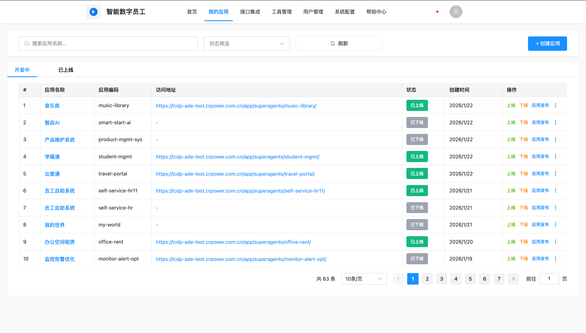

**进入方式：**

1. 登录平台后，点击顶部导航栏【我的应用】
2. 进入应用管理主页面，可看到"开发中"和"已上线"两个标签页

**功能说明：**

本模块主要包含以下核心功能：

- **应用全生命周期管理**：支持创建、编辑、发布、上线、下线及删除应用。
- **应用列表查询**：提供多维度的应用筛选和搜索功能。
- **数据源配置**：管理应用在测试环境和生产环境的数据库连接配置。
- **发布流程控制**：规范应用版本发布流程，确保配置的正确性。
- **日志记录**：记录详细的发布日志和操作日志，便于追溯和审计。

**主要功能列表：**

| 功能模块   | 功能说明                     | 适用场景       |
| :--------- | :--------------------------- | :------------- |
| 应用创建   | 创建新应用并配置基本信息     | 新应用开发     |
| 应用编辑   | 修改应用名称和绑定人员       | 应用信息维护   |
| 应用发布   | 版本发布和数据源配置         | 应用版本迭代   |
| 上下线管理 | 控制应用访问状态             | 应用状态控制   |
| 数据源管理 | 查看测试和生产环境数据源配置 | 环境管理       |
| 日志查询   | 查看发布和操作历史           | 问题排查和审计 |

## 应用列表管理

### 进入应用管理模块

操作步骤：

1. 登录**智能数字员工平台**。
2. 点击顶部导航栏的【应用管理】菜单。
3. 系统进入应用管理模块。
4. 页面默认显示**应用列表**页面。

### 应用列表字段说明

| 字段名称 | 字段说明         | 示例值              |
| :------- | :--------------- | :------------------ |
| #        | 序号             | 1, 2, 3...          |
| 应用名称 | 应用的显示名称   | 音乐库、智慧AI      |
| 应用编码 | 应用唯一标识     | music-library       |
| 访问地址 | 应用访问URL      | https://xxx.com/app |
| 状态     | 应用当前状态     | 已上线 / 已下线     |
| 创建时间 | 应用创建的时间戳 | 2026-01-20 10:30:00 |
| 操作     | 操作按钮组       | 上线、下载、编辑等  |

### 搜索和筛选应用

当应用数量较多时，可以通过以下方式快速定位应用：

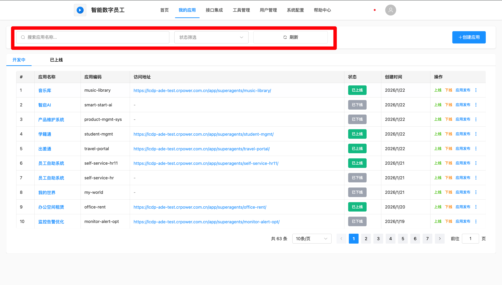

1. 在页面顶部找到搜索框。
2. 输入关键词（支持模糊搜索**应用名称**或**应用编码**）。
3. 点击搜索图标🔍或按 `Enter` 键执行搜索。
4. 使用状态下拉框筛选：选择【全部】、【已上线】、【运行中】或【已下线】。
5. 点击【刷新】按钮可重新加载列表数据。

### 创建新应用

操作步骤：

1. 在应用列表页面，点击右上角的【创建应用】按钮。
2. 平台可进入应用创建页面。具体操作可参考<strong>【创建空应用】</strong>章节。

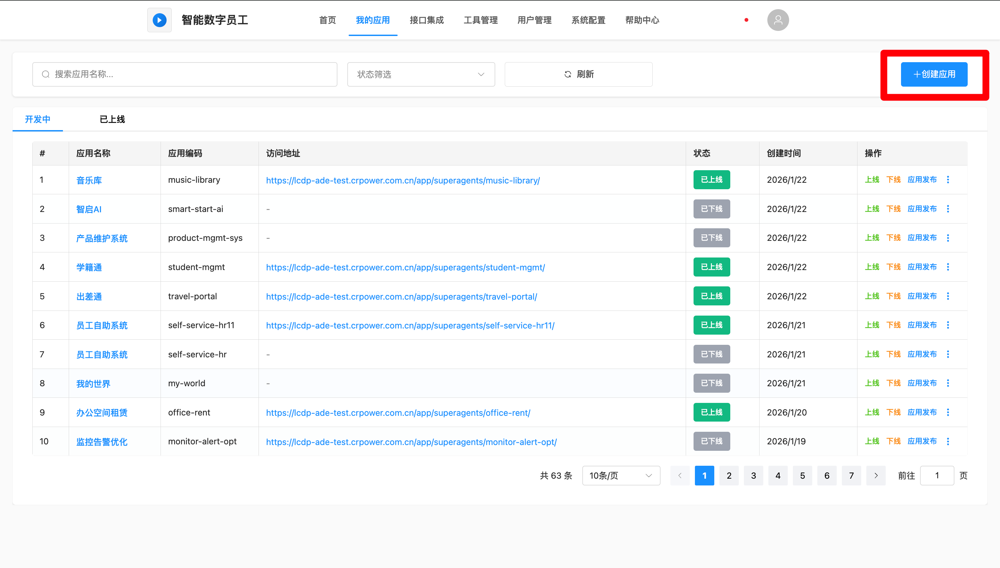

## 测试环境应用管理（开发中）

### 测试环境应用上线

**功能定位：**将处于"开发中/已下线"状态的应用在测试环境部署，完成可访问的状态切换。

**操作步骤：**

1. 进入【我的应用】→【开发中】标签页。
2. 找到目标应用，点击操作栏的【上线】按钮。
3. 系统弹出二次确认弹窗，显示"确认将应用部署至测试环境？"。
4. 点击【确认】后，按钮变更为"上线中..."，预计耗时3-10分钟。
5. 系统自动执行拉取代码、安装依赖、启动服务等操作。
6. 上线成功后，应用状态更新为"已上线"，生成唯一访问地址。

### 测试环境应用下线

**功能定位：**将已部署至测试环境的应用从目标环境中移除。

**操作步骤：**

1. 找到状态为"已上线"的应用，点击操作栏的【下线】按钮
2. 系统弹出确认弹窗："下线后应用将无法访问，确认继续？"
3. 点击【确认】后，系统自动停止服务并清理资源。
4. 下线完成后，状态更新为"已下线"。

 <strong>⚠️下线应用的影响：</strong>  应用下线后，用户立即无法访问，已登录会话可能中断。但应用数据不会丢失，可随时重新上线。 

### 应用基础信息修改

**功能定位：**支持用户修改本人管理应用的基础配置和核心信息。

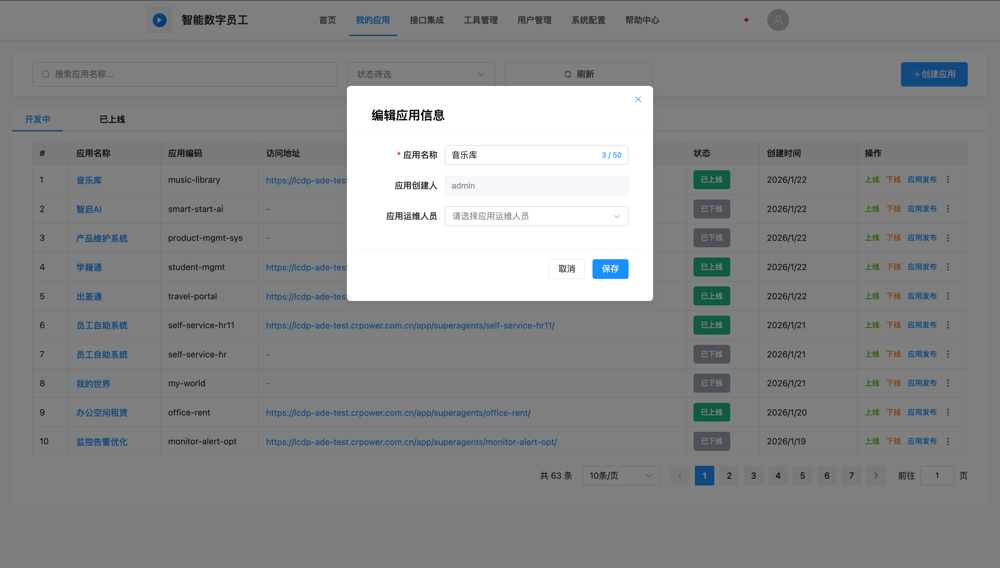

**操作步骤：**

1. 在应用列表中找到需要编辑的应用。
2. 点击该应用操作列的【编辑】按钮。
3. 在弹出的【编辑应用信息】对话框中修改信息。
4. 修改完成后，点击【保存】按钮提交；如需放弃，点击【取消】。

| 字段名称     | 是否可修改 | 说明                                                       |
| :----------- | :--------- | :--------------------------------------------------------- |
| 应用名称     | ✅ 可修改   | 修改应用的显示名称，不影响访问地址。                       |
| 应用创建人   | ❌ 不可修改 | 创建人信息固定，显示为只读。                               |
| 应用运维人员 | ✅ 可修改   | 从下拉列表重新选择授权用户，被授权用户可对该应用进行管理。 |

### 应用操作日志查看

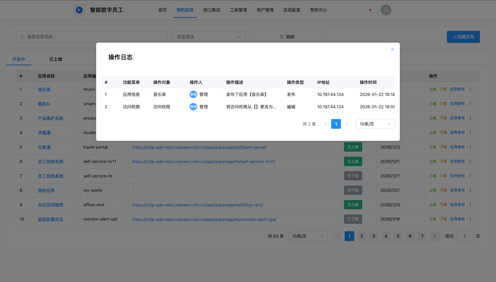

**查看步骤：**

1. 在应用列表找到目标应用，点击操作栏的【操作日志】按钮
2. 弹出日志查看弹窗，展示该应用的所有操作记录
3. 日志内容包含：操作人、操作类型、操作描述、操作时间、操作IP等

### 应用发布日志查看

**功能定位：**专门记录应用发起的发布申请、部署执行及结果反馈等全流程信息。

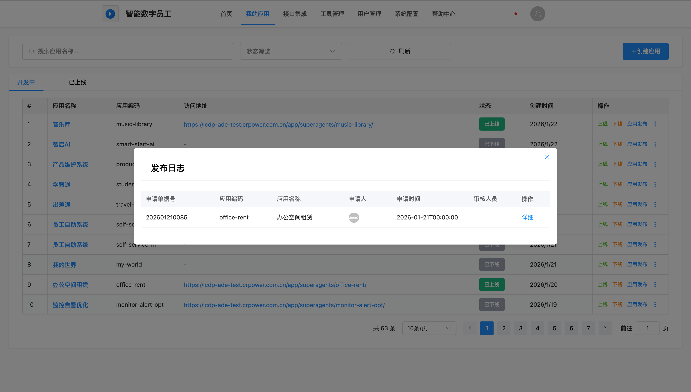

**查看步骤：**

1. 点击操作栏的【发布日志】按钮
2. 在弹窗中点击某条记录的【查看详情】按钮
3. 可查看：基本信息、发布配置、执行日志

### 查看数据源详情

点击应用操作列的【数据源详情】按钮，可查看该应用关联的所有数据源配置。

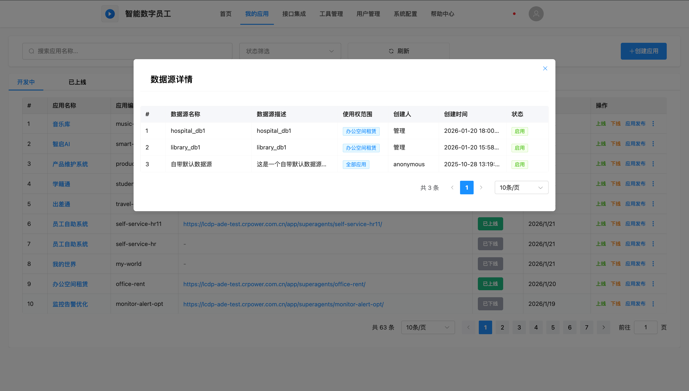

## 应用发布管理

### 应用发布流程概述

完整的发布流程如下：

📝 **步骤1**：点击【应用发布】按钮
📝 **步骤2**：配置数据源信息（测试环境和生产环境）
📝 **步骤3**：提交发布申请
📝 **步骤4**：等待发布自动化流程
✅  **步骤5**：发布成功，查看发布日志，在【已上线】标签页访问生产环境应用

### 配置数据源信息

在发布流程中，正确配置数据源是应用能否正常运行的关键。

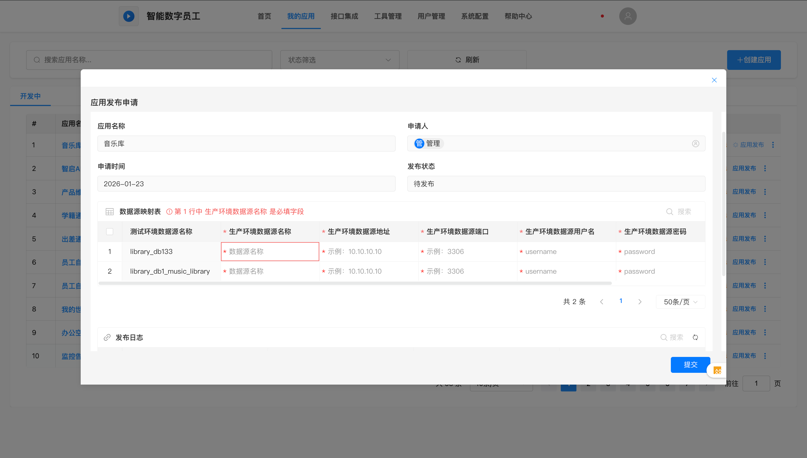

操作步骤：

1. 填写版本号点击发布后，进入【应用发布申请】对话框。
2. 确认自动填充的申请信息（应用编码、名称、申请人等）。
3. 在“数据源附带配置表格”中填写生产环境数据库信息。

| 字段名称             | 是否必填 | 字段说明                                               | 示例值        |
| :------------------- | :------- | :----------------------------------------------------- | :------------ |
| 测试环境数据源名称   | ❌只读    | 平台自动获取应用测试环境连接的数据源信息               | mysql-prod    |
| 生产环境数据库名称   | ✅ 必填   | 生产环境数据库名称                                     | music_db      |
| 生产环境数据库地址   | ✅ 必填   | 服务器IP或域名                                         | 192.168.1.100 |
| 生产环境数据源端口   | ✅ 必填   | 数据库端口号                                           | 3306          |
| 生产环境数据源用户名 | ✅ 必填   | 数据库连接用户名                                       | app_user      |
| 生产环境数据源密码   | ✅ 必填   | 数据库连接密码                                         | ********      |
| 生产数据库名称       | ✅ 必填   | 实际使用的数据库名，不填写时默认同步测试环境数据库名称 | music_prod_db |

4. 检查所有配置信息无误后，点击【提交】按钮。

### 发布流程详解

提交发布申请后，系统将自动执行3个步骤的发布流程。

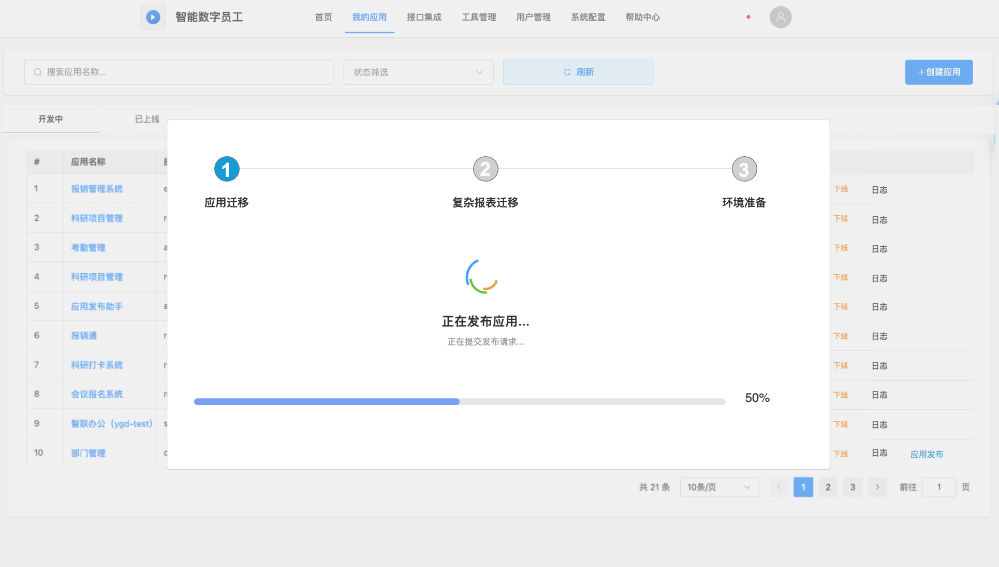

**步骤1：应用迁移**

**流程说明：**
🔵 当前步骤：应用迁移（蓝色圆圈标识，进行中）
⚪ 下一步骤：复杂报表迁移（灰色圆圈，未开始）
⚪ 最后步骤：环境准备（灰色圆圈，未开始）

- 进度显示：
  - 进度条：显示当前步骤进度（0-100%）。
  - 状态提示："正在发布应用..." 。
- **迁移内容**：应用页面配置、业务流程配置、表单配置、菜单权限配置、接口配置。
- **正常流程**：步骤1完成后，状态变为绿色圆圈（已完成✓），自动进入步骤2

**步骤2：复杂报表迁移**

**流程说明：**
✅ 步骤1：应用迁移（绿色圆圈，已完成）
🔵 当前步骤：复杂报表迁移（蓝色圆圈标识，进行中）
⚪ 下一步骤：环境准备（灰色圆圈，未开始）

- 进度显示：
  - 进度条：显示当前步骤进度（0-100%）。
  - 状态提示："正在迁移SmartBI报表..."。
- **迁移内容**：SmartBI复杂报表定义、报表数据源配置、报表权限配置、报表参数配置。
- **正常流程**：步骤2完成后，状态变为绿色圆圈（已完成✓），自动进入步骤3。

**步骤3：环境准备**

**流程说明：**
✅ 步骤1：应用迁移（绿色圆圈，已完成）
✅ 步骤2：复杂报表迁移（绿色圆圈，已完成）
🔵 当前步骤：环境准备（蓝色圆圈标识，进行中）

- 进度显示：
  - 进度条：显示当前步骤进度（0-100%）。
  - 状态提示："正在准备运行环境..."。
- **准备内容**：初始化数据库连接、创建必要的数据表结构、初始化系统参数、验证环境配置。
- **完成标志**：所有3个步骤都显示绿色圆圈（已完成✓），进度条达到100%，显示"发布成功"提示。

### 发布过程监控

**进度指示器说明**

| 状态标识 | 图标         | 说明               |
| :------- | :----------- | :----------------- |
| 未开始   | ⚪ 灰色圆圈   | 步骤尚未执行       |
| 进行中   | 🔵 红色圆圈   | 当前正在执行的步骤 |
| 已完成   | ✅ 绿色圆圈+√ | 步骤已成功完成     |
| 失败     | ❌ 红色圆圈+× | 步骤执行失败       |

**进度条说明**

- **蓝色进度条**：正常执行进度。
- **粉红色进度条**：执行失败状态。
- **进度百分比**：显示当前步骤的完成百分比（0-100%）。

### 发布失败处理

**步骤1失败：应用迁移失败**

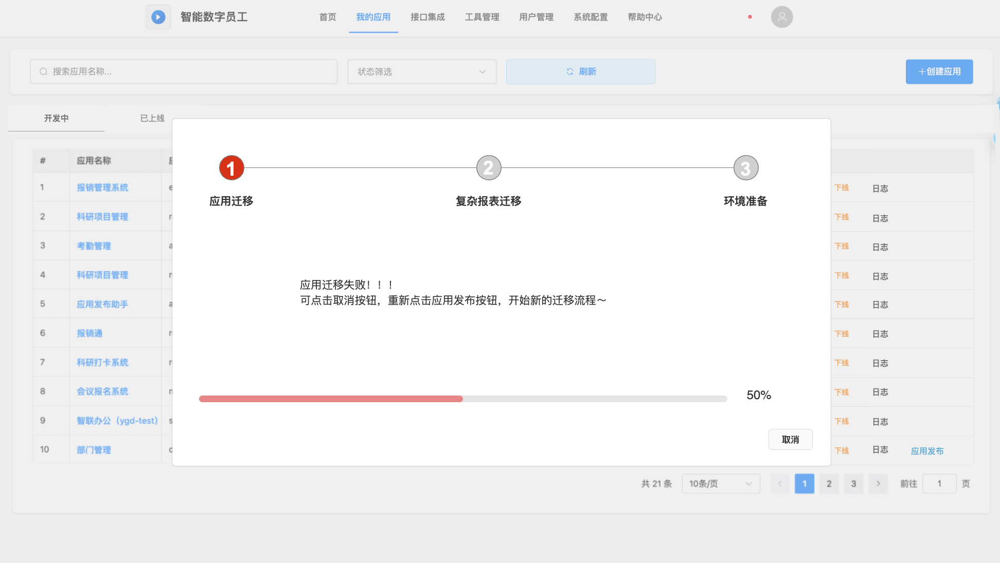

**失败提示信息：**
应用迁移失败！！！
已点击取消按钮，重新点击应用发布按钮，并检测的迁移流程～

- **进度显示**：进度条变为红色，显示失败时的进度百分比（例如：50%），步骤1显示红色圆圈（失败状态）。

**处理方式：**

| 操作     | 说明             | 适用场景                   |
| :------- | :--------------- | :------------------------- |
| 【取消】 | 取消本次发布流程 | 需要修改应用配置后重新发布 |

**操作步骤：**

1. 点击【取消】按钮关闭发布对话框。
2. 返回应用列表页面。
3. 检查应用配置是否正确。
4. 重新点击该应用的【应用发布】按钮。
5. 重新提交发布申请。

**步骤2失败：SmartBI报表迁移失败**

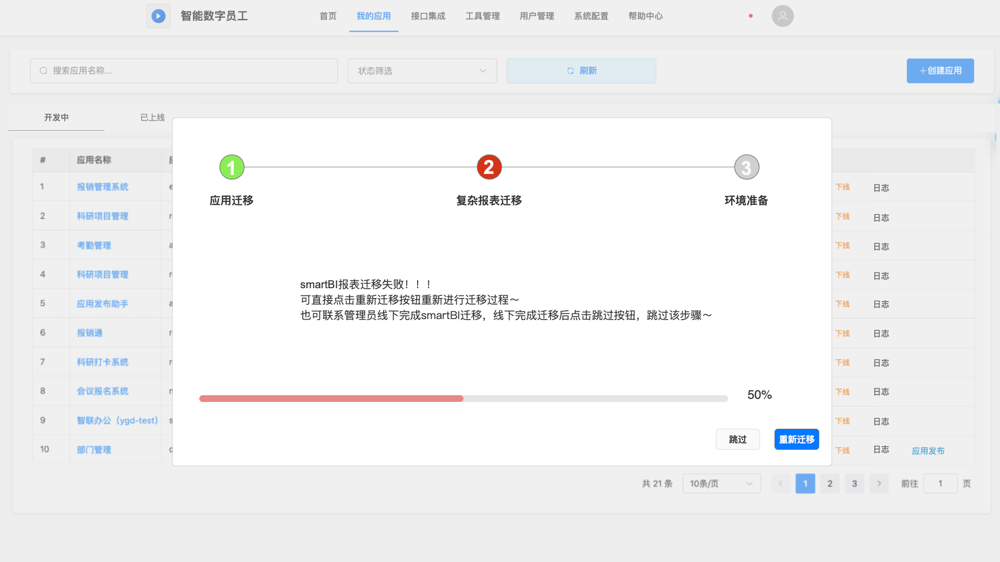

**失败提示信息：**
smartBI报表迁移失败！！！
可查核点击重新迁移按钮重新点击迁移按钮～
也可联系管理员联飞完成smartBI迁移，该下完成迁移后点击应用迁移，跳过该步骤～

**处理方式：**

系统提供两种处理方式：

| 操作按钮     | 说明                        | 适用场景               | 后续步骤                      |
| :----------- | :-------------------------- | :--------------------- | :---------------------------- |
| 【重新迁移】 | 重新执行当前步骤的迁移操作  | 临时问题导致的失败     | 系统自动重试迁移              |
| 【跳过】     | 跳过当前步骤，继续执行步骤3 | 需要管理员手动完成迁移 | 联系管理员手动完成SmartBI迁移 |

**重新迁移操作步骤：**

1. 点击【重新迁移】按钮。
2. 系统重新执行步骤2的迁移操作。
3. 观察进度条和状态提示。
4. 等待迁移完成或再次失败。

**跳过操作步骤：**

1. 联系系统管理员，说明报表迁移失败情况。
2. 管理员手动完成SmartBI报表迁移。
3. 确认管理员已完成迁移后，点击【跳过】按钮。
4. 系统继续执行步骤3（环境准备）。
5. 等待发布完成。

**⚠️ 注意事项：**

- 点击【跳过】前必须确保管理员已手动完成报表迁移。
- 如果未完成报表迁移就跳过，点击【跳过】按钮提示无法跳过。
- 建议优先使用【重新迁移】，只有在多次重试失败后才选择【跳过】。

### 常见失败原因及解决方案

**应用迁移失败原因**

| 失败原因         | 排查方法           | 解决方案               |
| :--------------- | :----------------- | :--------------------- |
| 网络连接中断     | 检查网络连接状态   | 确保网络稳定后重新发布 |
| 目标环境服务异常 | 检查目标服务器状态 | 联系管理员检查服务状态 |
| 应用配置错误     | 检查应用配置完整性 | 修正配置后重新发布     |

**报表迁移失败原因**

| 失败原因          | 排查方法            | 解决方案        |
| :---------------- | :------------------ | :-------------- |
| SmartBI服务未启动 | 检查SmartBI服务状态 | 启动SmartBI服务 |
| 报表定义错误      | 检查报表配置        | 修正报表定义    |
| 数据源连接失败    | 测试数据源连接      | 修正数据源配置  |
| 报表依赖缺失      | 检查报表依赖项      | 补充缺失的依赖  |

## 生产环境应用管理（已上线）

### 生产环境上线

**功能定位：**将处于“已下线”状态的生产环境应用重新部署上线，支持选择特定的历史版本进行增量部署，恢复生产服务访问。

**操作步骤：**

1. 点击导航栏“我的应用”，在左侧菜单切换至“已上线应用”标签页。
2. 找到目标应用，点击操作栏的【上线】按钮
3. 系统弹出二次确认弹窗，显示"确认将应用部署至测试环境？"
4. 点击【确认】后，按钮变更为"上线中..."，预计耗时3-10分钟。
5. 系统自动执行拉取代码、安装依赖、启动服务等操作。
6. 上线成功后，应用状态更新为"已上线"，生成唯一访问地址。

### 生产环境应用下线

**功能定位：**将已部署至生产环境的应用强制停止服务并清理资源。这是高风险操作，通常意味着业务服务的完全中断，应用不可再被访问。

**操作步骤：**

1. 点击导航栏“我的应用”，在左侧菜单切换至“已上线应用”标签页。
2. 找到状态为"已上线"的应用，点击操作栏的【下线】按钮
3. 系统弹出确认弹窗："下线后应用将无法访问，确认继续？"
4. 点击【确认】后，系统自动停止服务并清理资源。
5. 下线完成后，状态更新为"已下线"。

 <strong>⚠️下线应用的影响：</strong>  应用下线后，用户立即无法访问，已登录会话可能中断。但应用数据不会丢失，可随时重新上线。 

### 应用基础信息修改

**功能定位：**支持用户修改本人管理应用的基础配置和核心信息。

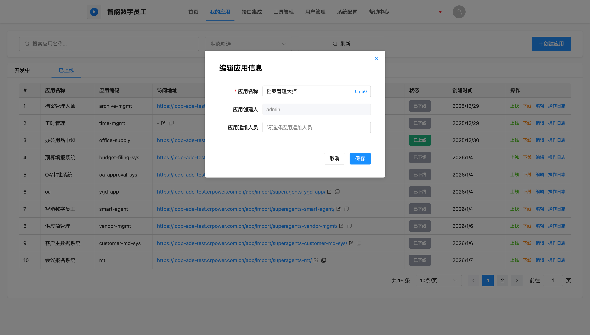

**操作步骤：**

1. 在应用列表中找到需要编辑的应用。
2. 点击该应用操作列的【编辑】按钮。
3. 在弹出的【编辑应用信息】对话框中修改信息。
4. 修改完成后，点击【保存】按钮提交；如需放弃，点击【取消】。

| 字段名称     | 是否可修改 | 说明                                                       |
| :----------- | :--------- | :--------------------------------------------------------- |
| 应用名称     | ✅ 可修改   | 修改应用的显示名称，不影响访问地址。                       |
| 应用创建人   | ❌ 不可修改 | 创建人信息固定，显示为只读。                               |
| 应用运维人员 | ✅ 可修改   | 从下拉列表重新选择授权用户，被授权用户可对该应用进行管理。 |

### 应用操作日志查看

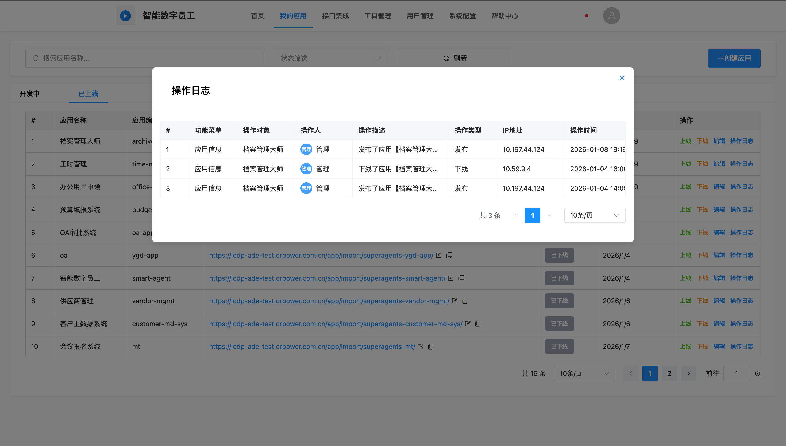

**查看步骤：**

1. 点击导航栏“我的应用”，在左侧菜单切换至“已上线应用”标签页。
2. 在应用列表找到目标应用，点击操作栏的【操作日志】按钮
3. 弹出日志查看弹窗，展示该应用的所有操作记录
4. 日志内容包含：操作人、操作类型、操作描述、操作时间、操作IP等

## 常见问题与解决方案

### 应用发布失败

- **数据源配置错误**：检查IP、端口、账号密码是否正确，数据库是否允许远程连接。
- **版本号格式错误**：请严格遵守 `X.Y.Z` 格式，使用数字。
- **发布权限不足**：联系管理员分配发布权限。

### 应用无法上线

- **应用未发布**：首次上线前必须先完成一次发布流程。
- **数据源未配置**：检查生产环境数据源配置是否完整。
- **访问地址冲突**：修改应用访问地址，确保唯一性。

### 数据源配置错误

- **生产环境连接失败**：检查防火墙规则、数据库白名单配置。
- **密码错误**：确认密码无多余空格，大小写正确。

### 操作权限问题

- **无法创建/编辑**：联系管理员分配相应权限或授权为应用绑定人员。