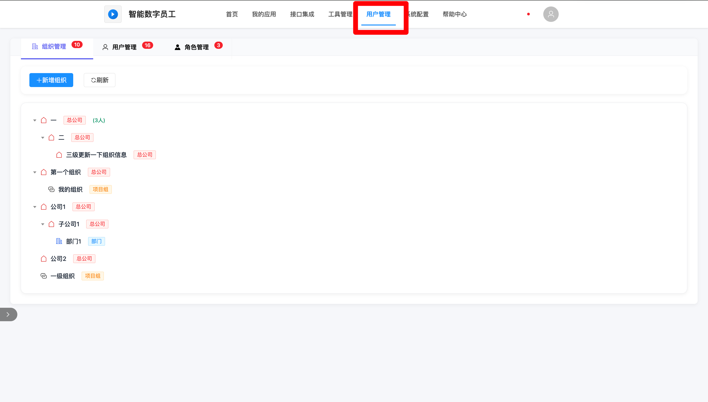
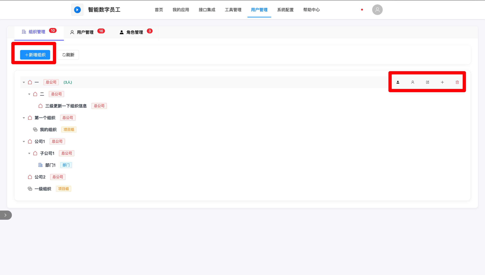
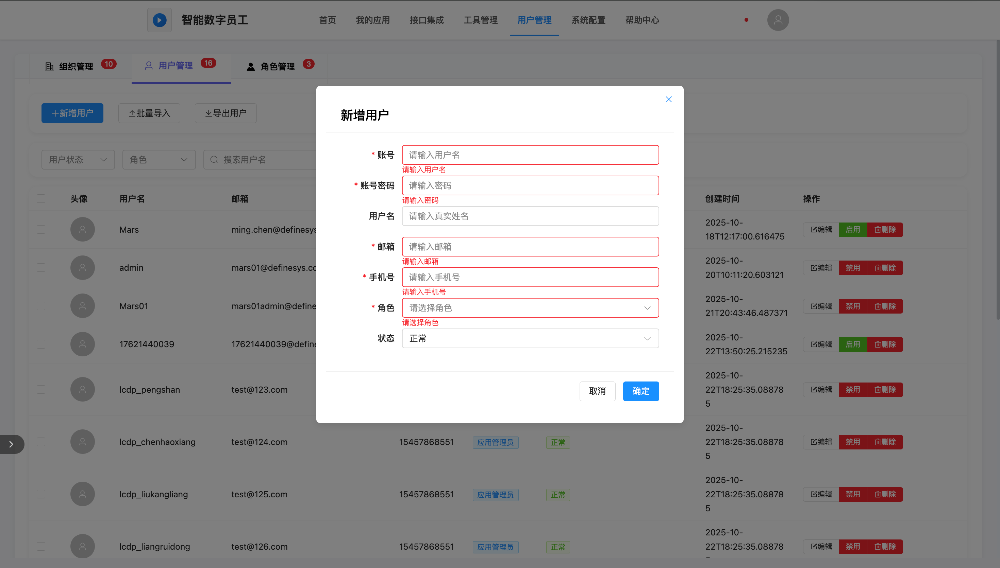
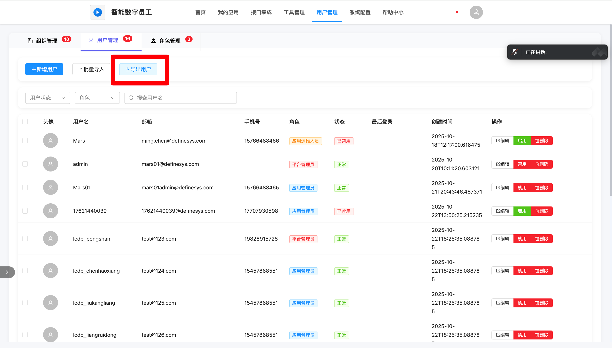
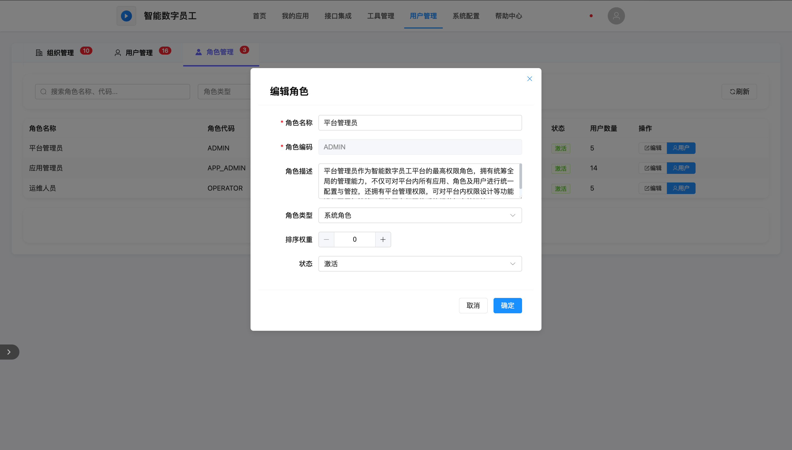
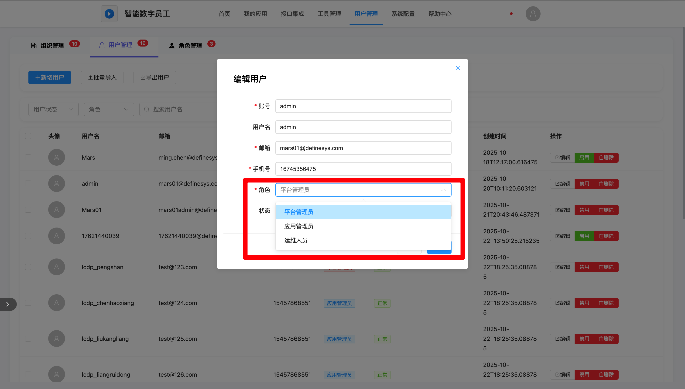
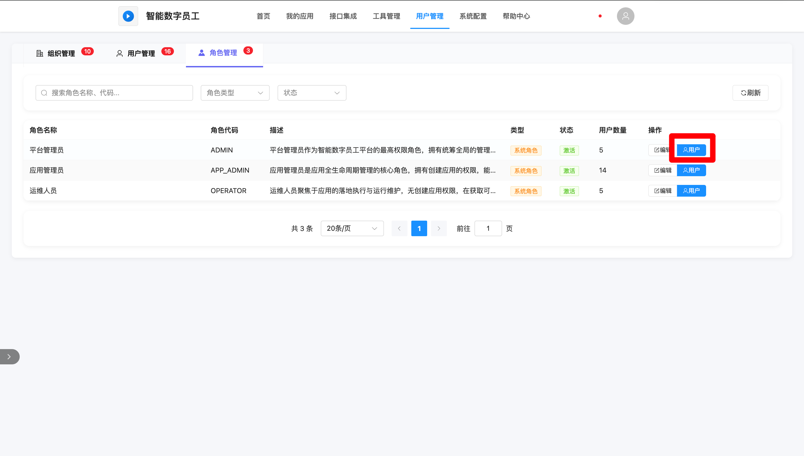

# 用户管理

## 入口

登录平台后，点击顶部导航栏【用户管理】（仅平台管理员可见）

**模块组成：**

- **组织管理**：管理企业组织架构
- **用户管理**：管理用户信息
- **角色管理**：管理角色和权限

## 功能概述

用户管理模块是平台的"身份认证与权限中枢"，核心职能为实现平台用户从创建、信息维护到权限分配的全流程管控。

## 组织管理

### 组织架构操作

| 操作       | 方法                                 | 说明                                                         |
| :--------- | :----------------------------------- | :----------------------------------------------------------- |
| 新增组织   | 点击页面【新增组织】按钮             | 填写名称、上级部门、负责人等组织信息。                       |
| 编辑组织   | 点击右侧操作栏上的【编辑】按钮       | 可修改名称、负责人、职能描述等组织信息。                     |
| 添加子组织 | 点击右侧操作栏上的【添加子组织】按钮 | 可填写名称、负责人等子组织信息，上级部门自动带出             |
| 删除组织   | 悬浮节点点击                         | 前提：该组织下无任何用户和子组织。                           |
| 添加用户   | 点击右侧操作栏上的【添加用户】按钮   | 可选择到全部状态为启用的用户                                 |
| 移除用户   | 点击右侧操作栏上的【移除用户】按钮   | 可将原本部门上的用户从组织下移除，但是历史数据所属部门信息不会改变 |
| 查看用户   | 点击右侧操作栏上的【查看用户】按钮   | 可查看部门下所有的用户                                       |

### 批量导入与导出

- **导入**：线下创建Excel导入文档，填写组织信息（名称、父级、负责人等），上传Excel完成批量创建。

## 用户信息管理

### 用户创建方式

**⽅式⼀： ⼿⼯创建**

点击【新增⽤⼾】， 填写姓名、 ⼯号、 部⻔、 岗位、⼿机号等必填信息。

**⽅式⼆： LDAP同步**

由企业LDAP系统自动将⽤⼾信息推送至智能数字员工平台。

**⽅式三： 批量导⼊**

线下创建Excel导入文档， 填写⽤⼾信息后上传， 系统⾃动校验并批量创建。

**创建方式对比**

- **LDAP同步（推荐）**：自动同步企业内部账号，保持信息一致。
- **手工创建**：适合少量特殊账号，需填写姓名、工号、部门、账号密码等。
- **批量导入**：通过Excel模板批量导入大批量用户。

### ⽤⼾状态管理

 禁⽤： 选择⽤⼾点击操作栏上的【禁⽤】按钮后，用户状态变更为“禁用”，该⽤⼾将⽆法登录。

 启⽤： 选择已禁⽤⽤⼾点击操作栏上的【启⽤】按钮后， 用户恢复正常状态，可正常登录。

## 角色与权限管理

### ⻆⾊体系说明

**功能定位：**基于RBAC（基于角色的访问控制）模型，构建“角色-权限-用户”的关联体系，实现权限的批量分配与集中管控，确保用户仅能访问其职责范围内的功能与数据，保障平台权限合规。

| 角色                            | 职责定位                                                     | 核心权限                                                     |
| :------------------------------ | :----------------------------------------------------------- | :----------------------------------------------------------- |
| **平台管理员 (Admin)**          | 平台管理员作为智能数字员工平台的最高权限角色，拥有统筹全局的管理能力，不仅可对平台内所有应用、角色及用户进行统一配置与管控，还拥有平台管理权限，可对平台内权限设计等功能进行配置与管控，保障平台权限体系的规范与高效运转。 | 用户管理、系统配置、所有应用管理、接口管理、帮助中心文档管理等全部平台权限 |
| **应用管理员 (App Admin)**      | 应用管理员是应用全生命周期管理的核心角色，拥有创建应用的权限，能够对授权应用开展设计、配置、测试及上线、下线等全流程管理工作。 | 应用创建、开发、发布、表单/报表创建，本人所有应用管理        |
| **应用运维人员 (App Operator)** | 运维人员聚焦于应用的落地执行与运行维护，无创建应用权限，在获取可操作应用列表时仅显示自身授权过的应用，可基于授权范围对应用执行创建表单、上线、下线等运维操作，保障应用的稳定运行与功能落地。 | 应用开发、发布、表单/报表创建，本人所授权的应用管理          |

### 分配与移除⻆⾊

**编辑角色信息：**

在相应的角色下，点击右侧操作栏上【编辑】按钮，即可编辑角色的信息。角色状态为「禁用」时在维护用户角色时不可选择到该角色，当角色状态为「激活」时该角色可在维护人员信息时被正常选择到。

**维护人员角色：**

创建用户时必须给新增用户添加一个相应的角色，在⽤⼾列表中选择⽤⼾， 点击用户信息， 可修改用户⻆⾊后保存。 

**注：**⼀个⽤⼾只可拥有一个⻆⾊。

**查看角色下用户**

在相应的角色下，点击右侧操作栏上【用户】按钮，即可查看角色下所有的用户。

